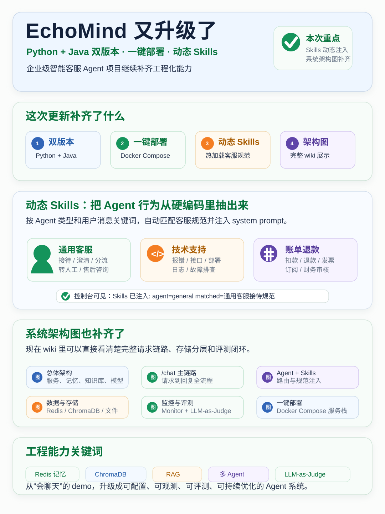

# EchoMind 项目更新推文图

本文档用于展示 EchoMind 本次更新的推文配图，可直接在 wiki、README、项目介绍或社交平台内容中引用。

## 核心信息

- EchoMind 已补齐 Python + Java 双版本、一键部署、动态 Skills 和系统架构图。
- 动态 Skills 支持按 Agent 类型和关键词注入，减少客服规则硬编码。
- Wiki 中已补充总体架构、`/chat` 主链路、Agent 与 Skills、数据存储、监控评测和一键部署图。
- 项目重点能力包括 Redis 工作记忆、ChromaDB 长期记忆和知识库、RAG、多 Agent 路由、Monitor 监控、LLM-as-Judge 端到端评测。
